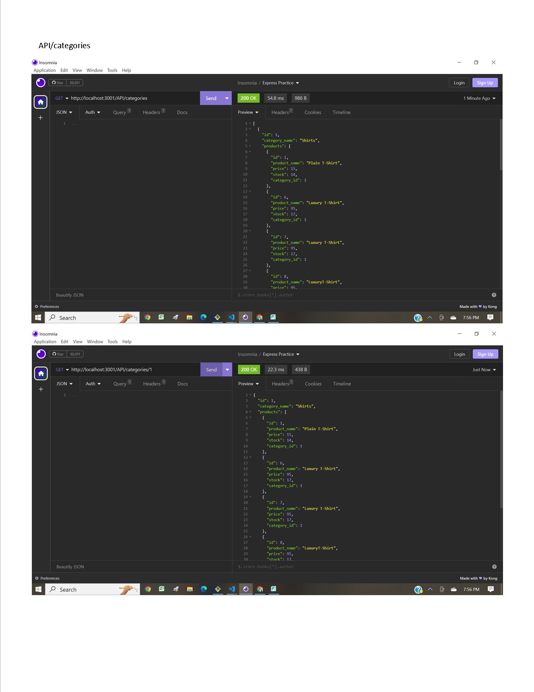
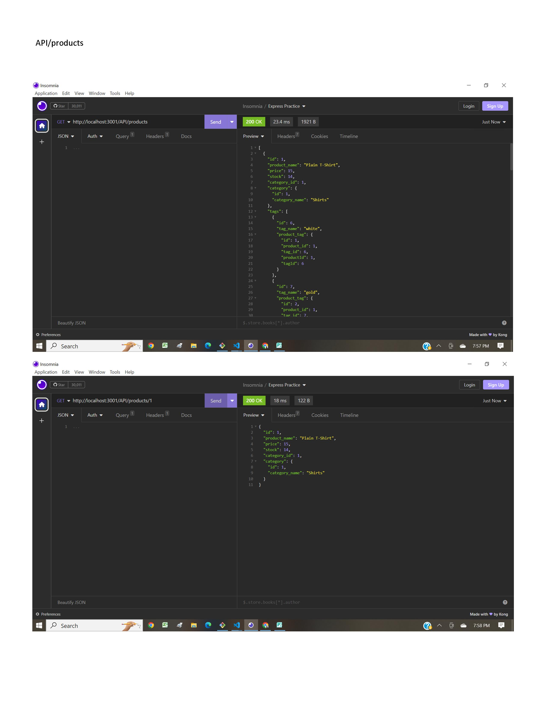
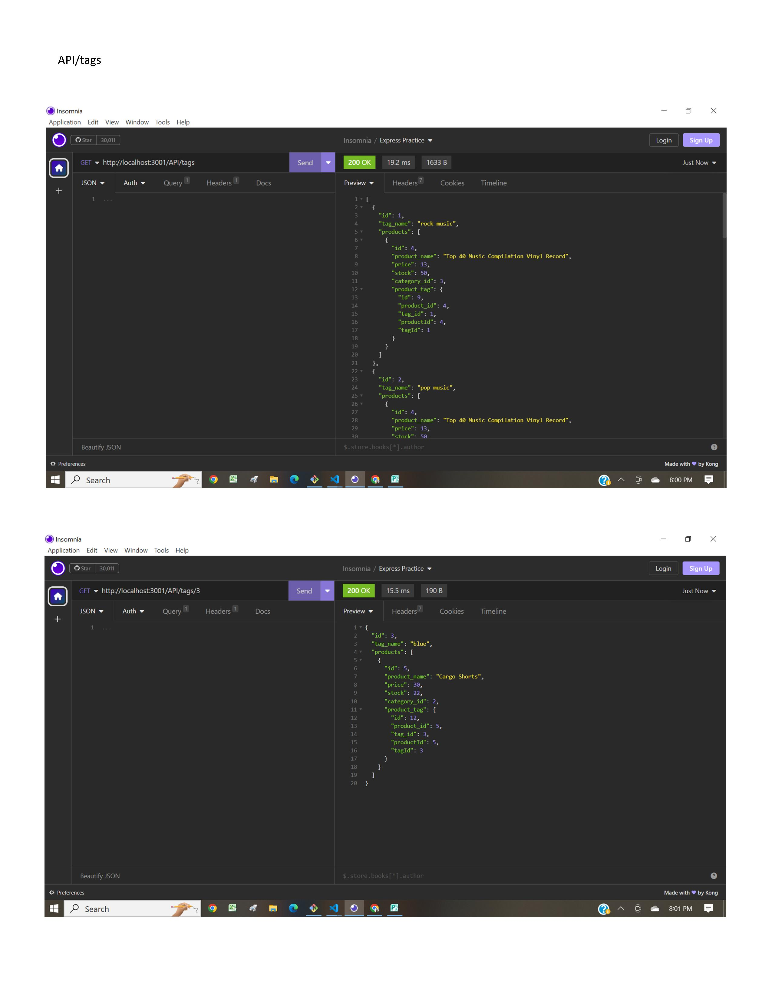

# EcommerceBackEnd
Challenger 13, Object-Relational Mapping (ORM) Chalenge: E-commerce Back End

This project uses node.js, Express.js API, MySQL, Sequelize and runs in Insomia.

NOTE: In order to run this, you need a dotenv file (.env) which contains your MySQL user name and password.

This is a simple eCommerce project that utilizes ecommerce_db whith 4 tables with a corresponding model and seed:
Category,
Product,
ProductTag and
Tag.

The user is able to connect to the database via Sequelize.
The user enters "SOURCE schema.sql" and "node seeds\index.js", the development database is created and is seeded with test data.
When the user invokes the application via "node server.js" the user is able to make changes to the 4 tables.
In Insomia, the user can test the following routes:
\API\categories: GET, GET with a specified Category ID, PUT with a specified Category ID to modify a Category, POST to create a new Category and DELETE a specified Category ID.
\API\products: GET, GET with a specified Product ID, PUT with a specified Product ID to modify a Product, POST 
to create a new Product and DELETE a specified Product ID.
\API\tags: GET, GET with a specified Tag ID, PUT with a specified Tag ID to modify a Product, POST
to create a new Tag and DELETE a specified Tag ID.

GITHUB repo:
https://github.com/agentpj/EcommerceBackEnd

Screencastify links:
For running the schema.sql and seeds.js and each of the tables:
https://watch.screencastify.com/v/o6VMoqbc4kicNOfalSvF

